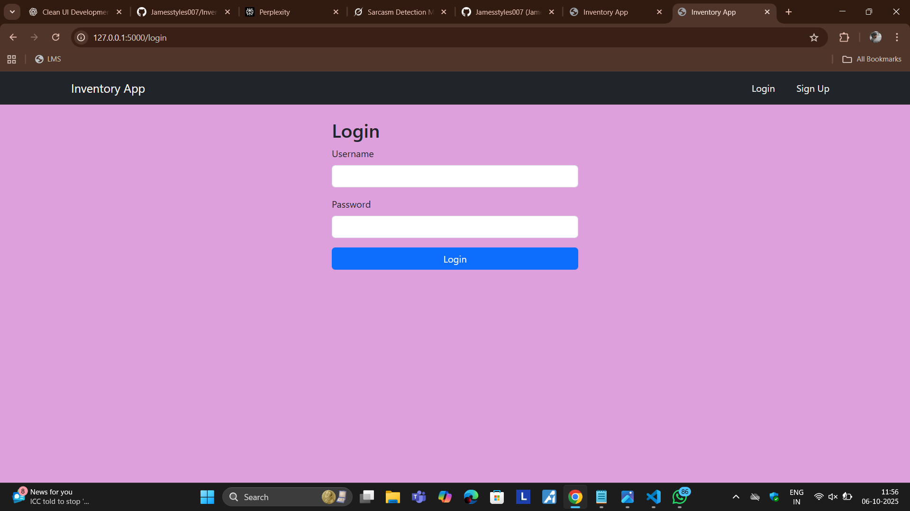
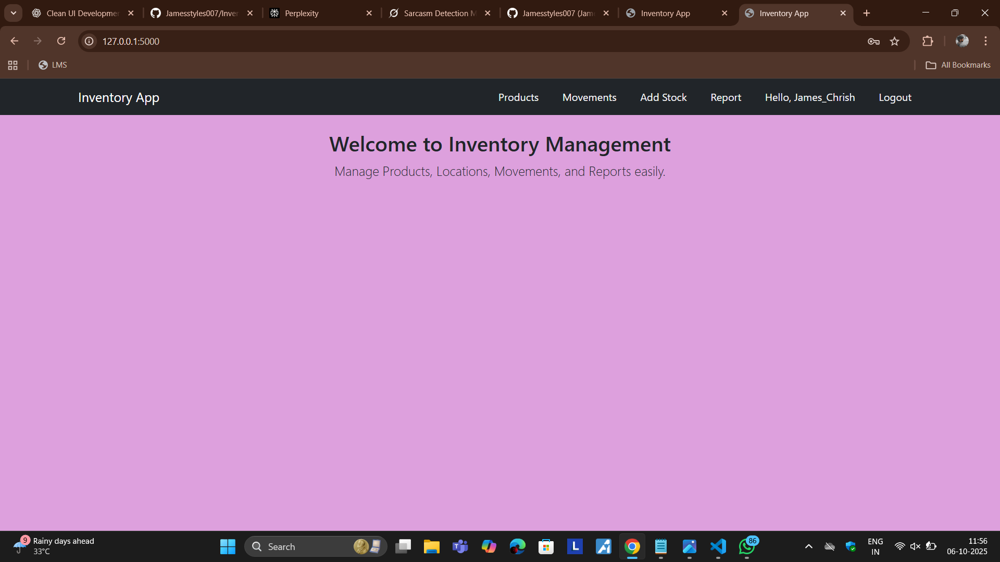
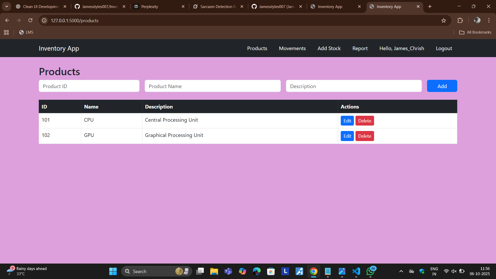
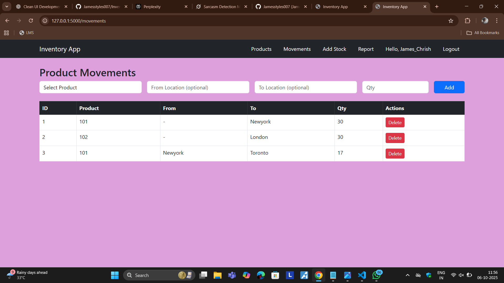
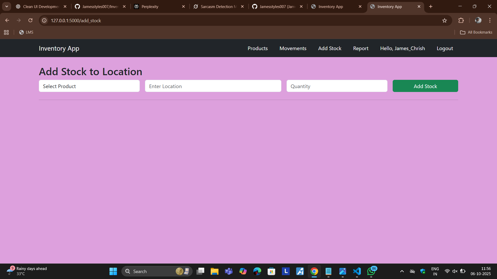
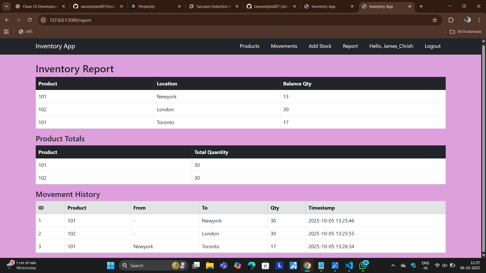

#  Inventory Management System

A modern **Inventory Management Web Application** built with **Flask, SQLite, Bootstrap, and Flask-Login**.  
This app allows businesses to manage products, track stock movements across locations, generate reports with timestamps, and secure access with **user authentication**.

---

## Features

- **User Authentication** (Sign Up, Login, Logout)  
- **Add Products** with ID, name, and description  
- **Edit / Delete Products**  
- **Add Stock** directly to any location  
- **Move Stock** between locations  
- **Reports** with per-location balances, totals, and movement history (with timestamps)  


---

## Tech Stack

- **Backend**: Flask (Python), Flask-Login, SQLAlchemy ORM  
- **Database**: SQLite (default), easily extendable to MySQL/PostgreSQL  
- **Frontend**: HTML5, Bootstrap 5, Jinja2 templating  
- **Styling**: CSS variables for centralized color control  
- **Authentication**: Flask-Login + Werkzeug password hashing  

---

## Project Structure

```

Inventory-App/
│── app.py                # Main Flask app (routes, logic)
│── models.py             # Database models (Product, Movement, User)
│── requirements.txt      # Dependencies
│── inventory.db          # SQLite database (auto-created)
│
├── templates/            # Jinja2 templates
│   │── base.html
│   │── index.html
│   │── products.html
│   │── edit_product.html
│   │── movements.html
│   │── add_stock.html
│   │── report.html
│   │── login.html
│   │── signup.html
│
├── static/
│   │── style.css         # Centralized theme colors
│
└── README.md             # Project documentation

````

---

## Installation & Setup

### 1️⃣ Clone the Repository
```bash

git clone https://github.com/Jamesstyles007/Inventory-App.git
cd Inventory-App

````


```

### 2️⃣ Install Dependencies

```bash
pip install -r requirements.txt
```

### 3️⃣ Run the Application

```bash
python app.py
```

### 4️⃣ Open in Browser

```
http://127.0.0.1:5000/

```

---

##  Usage Guide

### User Authentication

* **Sign Up** (first-time users) → create an account.
* **Login** (returning users) → enter credentials.
* **Logout** → securely exit the system.

### Inventory Management

* **Products** → Add, edit, delete products.
* **Add Stock** → Add items to a location.
* **Movements** → Transfer stock between locations.

### Reports

* See balance per product per location.
* View total stock per product.
* Review movement history with **timestamps**.

---


## Example Workflow

1. **Sign Up** as `john123`.
2. Add a product → `P001 | Laptop | Dell XPS`.
3. Add stock → 10 laptops into `Warehouse A`.
4. Move stock → 3 laptops from `Warehouse A` → `Shop`.
5. Generate report →

   * Warehouse A → 7
   * Shop → 3
   * Total = 10
   * History with timestamps

---


## Screenshots (Optional for GitHub)

## Login



## Home



## Products



## Products Movements



## Add Stock



## Report



---


##  Developer

** James Chrustobar P **  
Integrated M.Tech Computer Science & Engineering  
Erode Sengunthar Engineering College

- **Email**: [jameschrish623@gmail.com]
- **GitHub**: [github.com/Jamesstyles007]
- **LinkedIn**: [linkedin.com/in/james-chrustobar-p-5aa7a3256]
- **Leetcode**: [https://leetcode.com/u/jameschrish623/]

##  Conclusion

The Inventory Management System successfully demonstrates a robust and practical solution for modern inventory tracking needs. This project showcases the effective implementation of a full-stack web application using Flask framework and SQLite database, providing essential inventory management capabilities in a user-friendly package.
